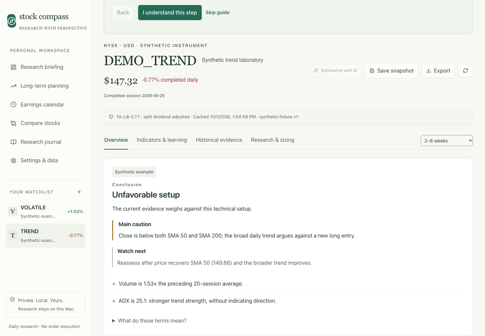
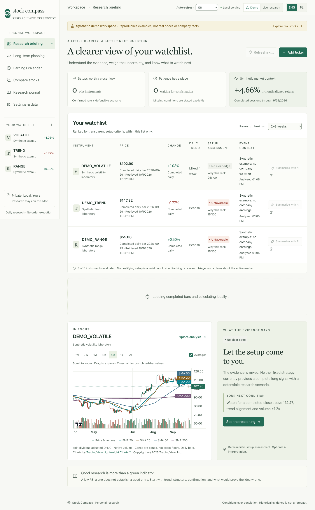
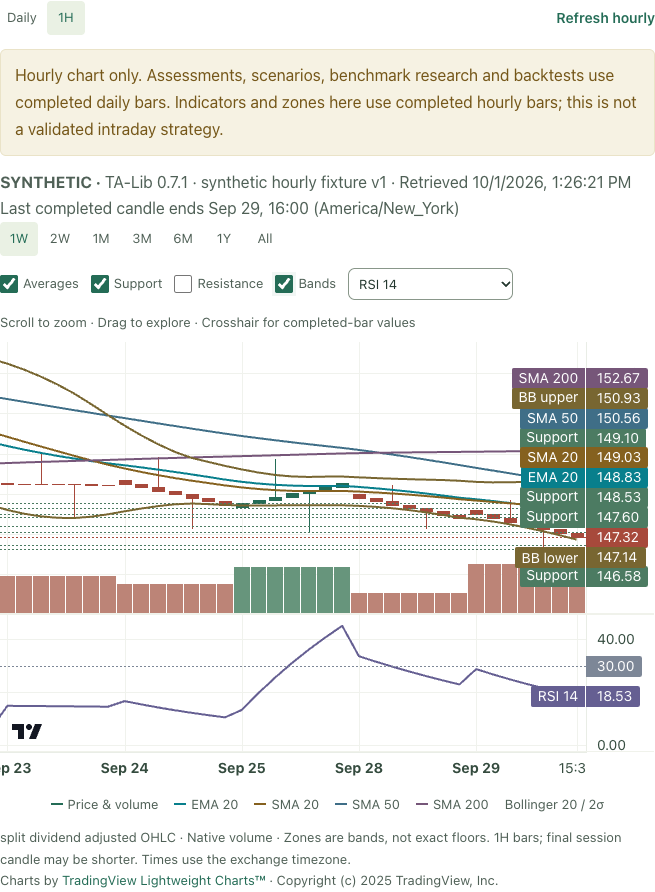
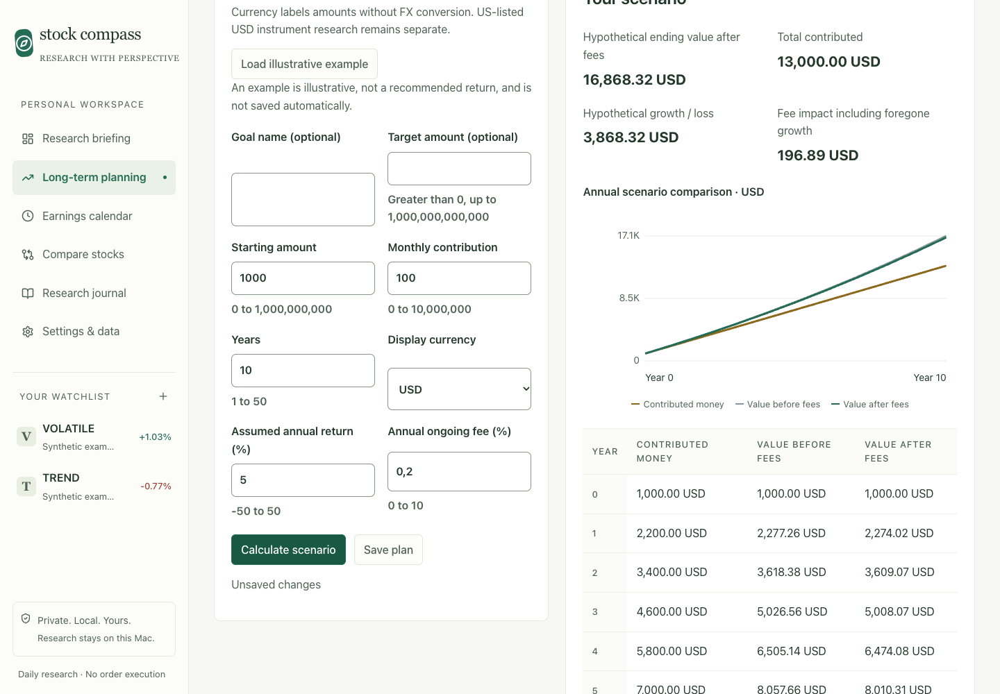
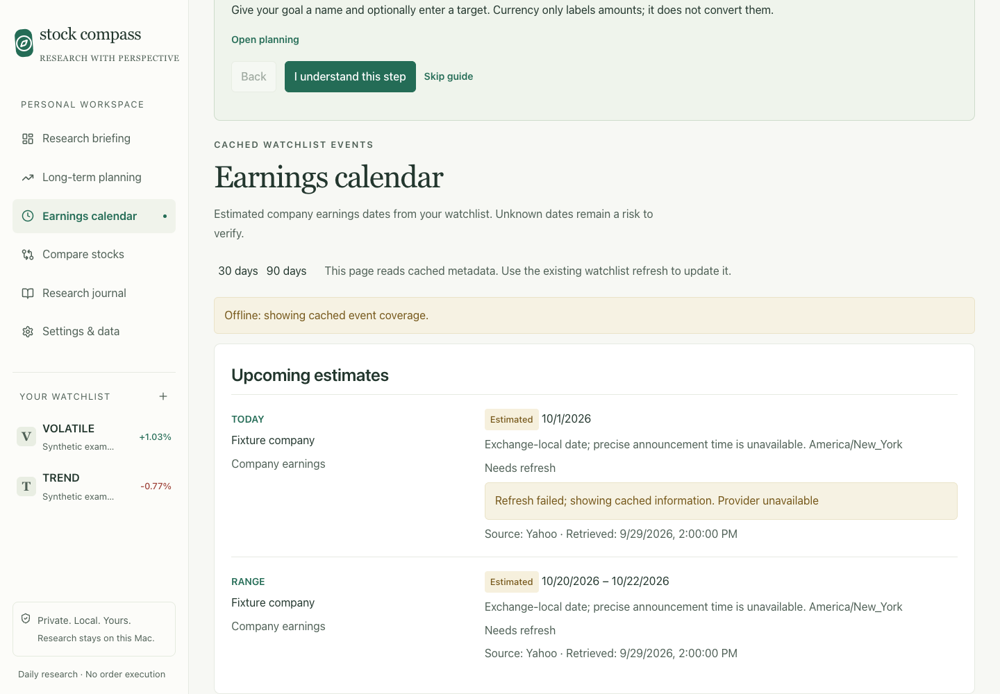
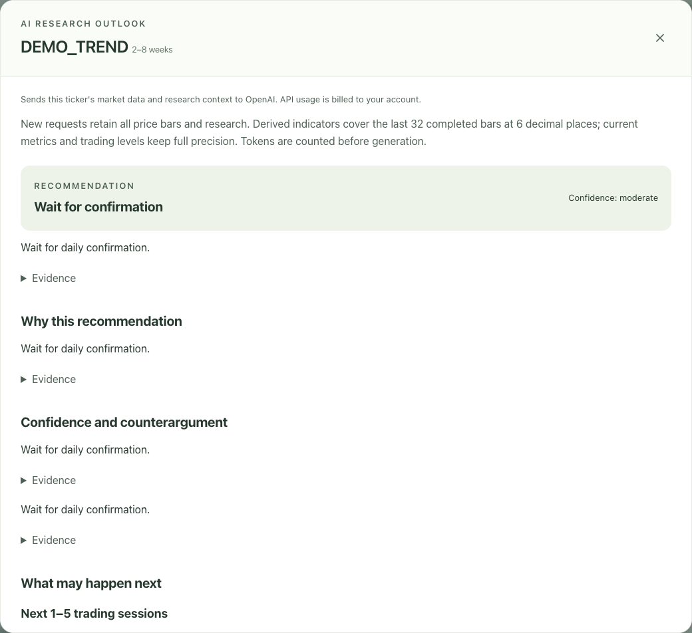

# Stock Compass

**Research with perspective.** A local workspace for understanding stocks, testing ideas, and planning regular investing.

Stock Compass brings charts, technical evidence, company context, backtests, and your research notes into one place. Start with a plain-language conclusion, inspect the evidence behind it, and record what would make you change your mind.

**Runs locally · English / Polish · Offline demo · Optional AI summaries**



*Screenshots use fictional instruments and controlled test data. They show the interface, not investment recommendations or personal research.*

[Quick start](#quick-start) · [Features](#features) · [AI summaries](#optional-ai-summaries) · [Data and privacy](#data-and-privacy) · [Development](#development) · [Documentation](#documentation)

## Quick start

You need **Python 3.12** and **Node.js 20+** with npm. The repository selects Node **24** in `.nvmrc` and Python **3.12** in `.python-version`. On macOS with Homebrew:

```bash
brew install python@3.12 node
```

Clone, install, and start:

```bash
git clone git@github.com:wmaciejak/stock-compass.git
cd stock-compass
./scripts/setup.sh
./scripts/start.sh
```

Open **http://127.0.0.1:8765**. Stop the app with **Ctrl+C**.

Setup installs the locked Python and npm dependencies and builds the frontend. TA-Lib installs from a binary wheel with its C library bundled. The scripts also support Linux. Installation requires internet access; the installed synthetic demo works offline. The core app requires no login, broker account, API key, paid data subscription, or Docker.

If the default port is busy:

```bash
STOCK_COMPASS_PORT=8766 ./scripts/start.sh
```

### Your first five minutes

1. Open the **Demo** workspace and select a fictional ticker such as `DEMO_TREND`.
2. Read **Conclusion**, **Main caution**, and **Watch next**. Open the evidence to understand the reasoning.
3. Explore the chart and **Indicators & learning**, then try a strategy in **Historical evidence**.
4. Save a note or idea in **Research & sizing**, or open **Long-term planning** to explore a savings scenario.
5. Switch to **Live research** when you want external market data. The starter tickers are editable examples, not suggested buys.

## Features

### A watchlist with reasons behind the ranking

The research briefing puts your instruments, daily trend, setup assessment, benchmark context, and event coverage in one view. Rankings reflect transparent technical criteria within your watchlist. Each stock explains its assessment, the opposing evidence, and the next condition to watch.

- Add and remove US-listed USD tickers, with separate Demo and Live workspaces.
- Select a research horizon: **1–2 weeks**, **2–8 weeks**, **1–6 months**, or **6–12 months**.
- Compare up to **four instruments** over matching session dates.
- Use **SPY** as the default live benchmark or choose another in Settings & data.
- See source timestamps, missing context, and restrictions alongside the results.

<details>
<summary>View the research briefing</summary>



*Demo workspace captured during a refresh; the fictional watchlist is shown alongside its evidence.*

</details>

### Interactive charts and real technical calculations

Inspect candlesticks and volume with zoom, pan, and a crosshair. Toggle moving averages, Bollinger Bands, support, and resistance; explore momentum and volatility without leaving the stock view.

| Evidence | What you can inspect |
| --- | --- |
| Trend | SMA 20 / 50 / 200, EMA 20, and completed-week context |
| Momentum | RSI 14, MACD, and ADX 14 |
| Volatility | ATR 14 and Bollinger Bands |
| Volume | Volume context and on-balance volume |
| Structure | Support/resistance zones and conditional scenario levels |
| Relative strength | Performance against the selected benchmark |

**Daily / 1H** switches between completed daily and hourly candles. Hourly indicators and zones are calculated from hourly bars, with their own cache and refresh control.



*Assessments, scenarios, benchmark research, backtests, and exports continue to use completed daily bars. Hourly charts do not constitute a validated intraday strategy.*

### Learn as you research

New installations start in **Beginner** view. The stock overview leads with a readable conclusion and the most important caution; **Explore the evidence** opens the technical details.

A resumable guide helps you **Understand a stock** or **Plan regular investing**. Indicator explanations describe both the reading and common interpretation mistakes. Switch to Advanced in Settings & data when you want the fuller research view. Guide progress and settings survive restarts.

### Test an idea against historical evidence

Run the fixed **crossover** or **breakout** strategy with editable commission, spread, and starting cash. Inspect results against a matching buy-and-hold baseline, then return to the assumptions that produced them.

Backtests use causal daily rules and show their provenance. Stale, corrupted, insufficient, or unknown-basis data block simulation rather than produce a misleading result. Historical performance does not establish future returns; changing the research horizon does not change the fixed strategy definitions.

### Keep your research and sizing together

Use **Research & sizing** to write notes, save an idea, capture an analysis snapshot, and calculate position sizing from your own entry, stop, account amount, and risk input. The app does not infer your holdings or risk budget.

Review ideas and outcomes in the **Research journal**. Export a **Markdown research report** in the selected language or **CSV price bars** for further analysis. Removing a ticker from the watchlist retains its saved research.

### Explore long-term investing scenarios

Model a starting amount, regular monthly contribution, time horizon, assumed annual return, and ongoing fee. Compare contributions with hypothetical values before and after fees, inspect an annual table, and save the plan locally.



*Illustrative inputs, not a recommended return. Currency choices label amounts without converting them.*

The calculation applies monthly growth factors and adds contributions at the end of each month. Fee impact includes foregone growth. The model excludes taxes, inflation, transaction costs, FX movement, and changing returns. Built-in ETF lessons explain diversification, index tracking, fees, distributions, and currency exposure.

### Keep earnings uncertainty visible

The **Earnings calendar** shows estimated company dates across **30-day** and **90-day** windows. It distinguishes upcoming dates, unknown coverage, stale metadata, and instruments where company earnings are not applicable.



*Controlled calendar fixtures demonstrate estimated dates and failed-refresh warnings. Opening the calendar reads cached metadata; ordinary watchlist refresh updates it.*

## Optional AI summaries

**Summarize with AI** is available in ticker rows and stock headings. An explicit generation asks OpenAI for an evidence-based recommendation, a near-term outlook, and **base, bullish, and bearish scenarios**, with confirmation conditions, counterarguments, limitations, and evidence references.

The default configured model is **`gpt-6-luna`**. The backend captures the selected ticker's available context: daily and hourly history, benchmark research, technical readings, available company/news context, saved backtests, snapshots, notes, journal entries, and relevant drafts or sizing inputs.



*The panel above uses a controlled test response to demonstrate the layout, not a live model forecast.*

To enable it, copy `.env.example` to `.env` if you have not already created local configuration, then set:

```dotenv
OPENAI_API_KEY=your-api-key
STOCK_COMPASS_AI_ENABLED=1
STOCK_COMPASS_AI_MODEL=gpt-6-luna
STOCK_COMPASS_OFFLINE=0
```

Restart the app after changing configuration. **AI is optional, disabled by default, and unavailable in offline mode.** Core assessments and learning tools work without it.

**Generation sends market and personal research context to OpenAI and is billed to your API account.** Navigation and auto-refresh do not generate summaries. Regenerate can incur another charge. The backend counts tokens before uncached generation and enforces a configurable request budget; requests can still hit account limits.

All available price bars and research are retained. Derived historical indicators cover the latest **32 completed bars**, rounded to **six decimal places**; current metrics and trading levels retain full precision. Saved results can be reused for matching context. The backend validates structured output and evidence references, but that does not guarantee the interpretation is correct.

See [AI setup, context, billing, and recovery](docs/AI.md) for all controls and error diagnostics.

## Data and privacy

### Three ways to use market history

| Mode | Source | When to use it |
| --- | --- | --- |
| Synthetic demo | Reproducible fictional price histories | Learn the interface and test workflows offline |
| Live research | yfinance / Yahoo Finance, unofficial | Inspect external US equity data and available company context |
| CSV import | Your supplied daily OHLCV history | Research a declared dataset with explicit adjustment conventions |

Live prices may be delayed, unavailable, or revised. A recent regular-session provider quote is labeled **provisional** and kept separate from the completed daily close. Indicators, scenarios, and strategy results remain based on completed daily bars. Missing real-ticker data never become invented synthetic prices.

Manual refresh is available throughout the workspace. Optional auto-refresh runs every **1, 5, 15, or 30 minutes**, pauses in hidden tabs, and avoids overlapping scheduled runs. Provider failures retain the original cache timestamps and warnings. Frequent refresh of large watchlists can encounter provider limits.

### Import CSV or work offline

Settings & data validates and previews a CSV before explicit import:

```csv
Date,Open,High,Low,Close,Volume
2026-09-28,100,102,99,101,1000000
2026-09-29,101,103,100,102,1200000
```

These rows illustrate the format only. Supply the symbol, name, US exchange, USD currency, and adjustment basis. Imports replace the entire source series. Unknown or unadjusted basis allows inspection but blocks actionable analysis and backtests; simulations require at least **220 sessions**. Built-in demo fixtures cannot be overwritten.

Set `STOCK_COMPASS_OFFLINE=1` in `.env` to disable external downloads while keeping demo, CSV, and cached history available. The demo uses its own fictional `DEMO_MARKET` benchmark and fixed historical dates.

### What stays on your machine

Research is stored in **`data/compass.sqlite`**: watchlists, settings, notes, journal entries, plans, cached data, snapshots, backtests, and captured AI results/context. Back up the database with the app stopped.

**The entire `data/` directory and `.env` are excluded from Git.** Logs, installed dependencies, builds, and local agent records are excluded too. The repository includes fictional test fixtures and documentation screenshots.

The launcher binds to loopback. This is a single-user local application; the API has no user authentication and is not designed for public hosting. Browser-origin and Host checks provide additional restrictions. Protect your local credential/database files with appropriate filesystem permissions. Live research contacts external data providers; explicitly requested AI generation sends context to OpenAI.

## Development

| Layer | Technology |
| --- | --- |
| Interface | React, TypeScript, Vite, Lucide |
| Charts | TradingView Lightweight Charts |
| API and validation | FastAPI, Pydantic, Uvicorn |
| Analysis | pandas, NumPy, TA-Lib |
| Historical simulation | Backtesting.py |
| Storage | SQLite |
| Market data | yfinance and CSV adapter |
| Optional AI | OpenAI Python SDK and Responses API |
| Verification | pytest, Playwright, GitHub Actions |

Python dependencies are pinned in `requirements.lock`; frontend dependencies are locked in `frontend/package-lock.json`.

After setup, run the checks:

```bash
.venv/bin/python -m pytest -q
npm run build --prefix frontend
npm test --prefix frontend
```

Browser tests use installed Google Chrome on macOS when available; otherwise install Playwright's Chromium first:

```bash
cd frontend
npx playwright install chromium
cd ..
```

On Linux use `npx playwright install --with-deps chromium`. Browser tests start an isolated offline service on port **8767**, use a fresh temporary database, and disable AI. `COMPASS_CHROME` selects a browser executable; `COMPASS_TEST_DB` selects an explicit disposable database path.

The recorded baseline is **216 backend tests**, **62 browser workflows**, and a successful production build. GitHub Actions is configured to run setup, backend tests, build, and browser checks on Ubuntu for pushes to `main` and pull requests, without paid AI calls. See [verification details and limitations](docs/VERIFICATION.md) and [contribution instructions](CONTRIBUTING.md).

## Documentation

| Guide | Covers |
| --- | --- |
| [Data conventions](docs/DATA.md) | Adjusted prices, completed sessions, cache, freshness, and unavailable states |
| [Strategy rules](docs/RULES.md) | Causal signals, execution assumptions, sizing, gaps, and evaluation |
| [Hourly charts](docs/HOURLY.md) | Hourly history, separate indicators, and adjustment limitations |
| [AI summaries](docs/AI.md) | Context, configuration, token budgets, billing, and recovery |
| [Provider notes](docs/PROVIDERS.md) | Data-source limitations and extension points |
| [Verification](docs/VERIFICATION.md) | Recorded checks and remaining limits |
| [Contributing](CONTRIBUTING.md) | Local workflow and project conventions |
| [Dependency licenses](docs/LICENSES.md) and [notice](NOTICE) | Third-party licensing and TradingView attribution |

Stock Compass supports research and education. Its heuristic scores are not profit probabilities or personalized suitability assessments. Historical performance and hypothetical savings scenarios do not predict future returns. A conclusion that no setup qualifies is a valid result.
